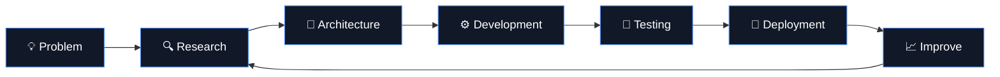
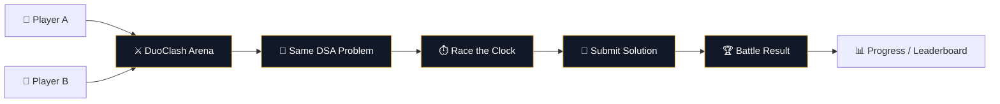
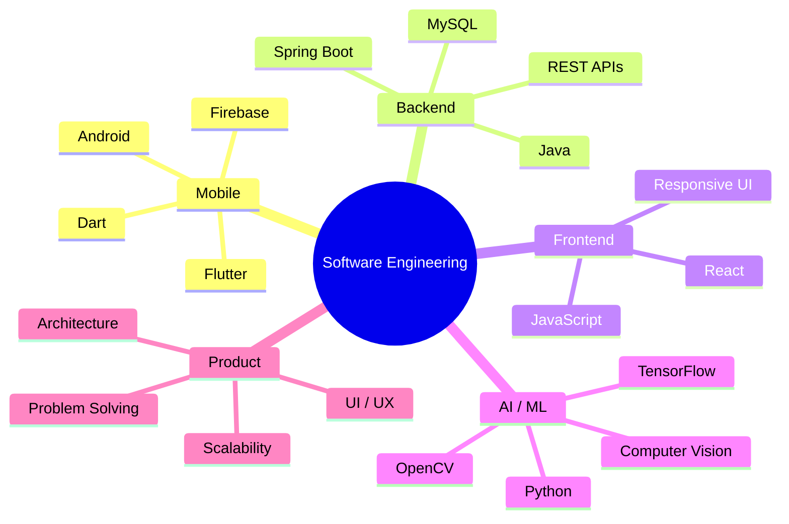

<div align="center">

<a href="https://github.com/Rj-Inovite">
  
</a>

<br/>


<br/><br/>

<a href="https://github.com/Rj-Inovite?tab=repositories">
  
</a>
&nbsp;
<a href="https://github.com/Rj-Inovite">
  
</a>
&nbsp;
<a href="mailto:ruchijasmatiya36@gmail.com">
  
</a>

</div>

---

# Ruchi Jasmatiya

### Software Developer | Mobile • Full Stack • AI/ML

I build **mobile applications, full-stack systems, backend services, and AI-powered products** with a focus on clean architecture, practical problem solving, and scalable engineering.

My work sits at the intersection of:

```text
Mobile Engineering
        │
        ├──────────────┐
        │              │
   Flutter / Dart   Android
        │
        ▼
Full Stack Engineering
        │
   React • Java • Spring Boot
        │
        ▼
AI / Machine Learning
        │
 Python • TensorFlow • OpenCV
        │
        ▼
Real-world Digital Products
```

> **I enjoy turning complex ideas into reliable, usable software.**

---

# ⚡ Engineering Focus

<table>
<tr>
<td width="50%" valign="top">

### 📱 Mobile Engineering

* Flutter & Dart
* Android application development
* REST API integration
* Firebase
* Responsive UI systems
* Application architecture

</td>

<td width="50%" valign="top">

### 🌐 Full Stack Engineering

* Java & Spring Boot
* React
* RESTful APIs
* Authentication & authorization
* MySQL
* Backend architecture

</td>
</tr>

<tr>
<td width="50%" valign="top">

### 🤖 AI / ML

* Python
* TensorFlow / Keras
* OpenCV
* Computer Vision
* Deep Learning
* AI-powered applications

</td>

<td width="50%" valign="top">

### 🎨 Product Engineering

* UI/UX design
* Responsive interfaces
* Clean architecture
* API design
* Git & GitHub
* Developer tooling

</td>
</tr>
</table>

---

# 🧩 Tech Stack

<div align="center">

### Languages


### Mobile & Frontend


### Backend & Database


### AI / Development Tools


</div>

---

# 🏗️ How I Build



### My engineering approach

**Understand → Design → Build → Test → Ship → Iterate**

I prefer building systems where the UI, APIs, data layer, and underlying logic work together rather than treating each component independently.

---

# 🚀 Featured Work

## 🔐 AMS

**Application Management System**

A secure backend-oriented application built around:

```text
Spring Boot
     │
     ├── REST APIs
     ├── JWT Authentication
     ├── Role-Based Access Control
     └── MySQL
```

Focus:

* Secure API architecture
* Authentication
* Authorization
* Database integration
* Backend service design

---

## 🤖 VeriFace-X

**AI-powered Face Forgery Detection**

A computer-vision project exploring face authentication and forgery detection using:

```text
Input Image
     ↓
Face Detection
     ↓
Preprocessing
     ↓
Feature Extraction
     ↓
Deep Learning Model
     ↓
Forgery / Authenticity Result
```

**Technologies**

`Python` `TensorFlow` `Keras` `OpenCV` `CNN` `ML Kit`

---

## 📱 Smart Attendance System

An intelligent attendance application combining:

```text
Flutter UI
     ↓
Camera / ML Processing
     ↓
Face / Presence Detection
     ↓
Firebase
     ↓
Attendance Data
```

**Technologies**

`Flutter` `Dart` `Firebase` `Computer Vision` `REST APIs`

---

## 🛍️ Eyewear E-Commerce

A modern full-stack shopping experience built with:

`React` `REST APIs` `Responsive UI`

Focus areas:

* Product discovery
* Responsive interfaces
* API integration
* E-commerce workflows

---

# ⚔️ DuoClash

### Two Minds. One Battle.

I'm also building **DuoClash**, a competitive DSA coding battle platform where players solve programming challenges head-to-head.



**Stack**

`React` `Vite` `JavaScript` `React Router` `CSS` `Supabase Realtime`

🔗 **[Explore DuoClash →](https://github.com/Ruchitra-Jasmatiya/DuoClash)**

---

# 📊 GitHub Engineering Activity

<div align="center">

<a href="https://github.com/Rj-Inovite">

</a>

<a href="https://github.com/Rj-Inovite">

</a>

<br/><br/>


</div>

---

# 📈 Contribution Activity

<div align="center">


</div>

---

# 🏆 GitHub Profile

<div align="center">


</div>

---

# 🌱 Current Focus

```text
┌───────────────────────────────────────────────┐
│              CURRENTLY BUILDING                │
├───────────────────────────────────────────────┤
│                                               │
│  🤖 Generative AI & LLM Applications          │
│                                               │
│  📱 Advanced Flutter Architecture             │
│                                               │
│  ☁️ Scalable Spring Boot Services             │
│                                               │
│  🧠 AI-powered Mobile Solutions               │
│                                               │
│  ⚡ Clean Architecture & REST API Design      │
│                                               │
└───────────────────────────────────────────────┘
```

---

# 🧠 Engineering Interests



---

# 🔬 What I'm Exploring

| Area               | Direction                           |
| ------------------ | ----------------------------------- |
| 🤖 AI              | Generative AI, LLM applications     |
| 📱 Mobile          | Advanced Flutter architecture       |
| ☁️ Backend         | Scalable Spring Boot services       |
| 🧠 ML              | Computer Vision & Deep Learning     |
| 🌐 Web             | Full-stack application architecture |
| ⚡ Engineering      | Clean architecture & API design     |
| 🧩 Problem Solving | DSA & competitive programming       |

---

# 🤝 Let's Connect

<div align="center">

<a href="mailto:ruchijasmatiya36@gmail.com">

</a>

<a href="https://github.com/Rj-Inovite">

</a>

<a href="https://www.linkedin.com/in/ruchitra-j-613a362a8/">

</a>

</div>

---

<div align="center">

### `BUILD → LEARN → SHIP → IMPROVE`

<br/>


<br/><br/>

**Thanks for visiting my profile.**

⭐ *Explore the repositories below to see what I'm building.*

</div>
